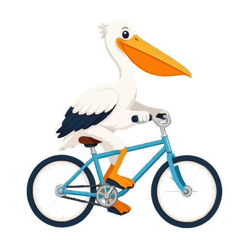

# 1-Shot SVG

An installable agent skill for making polished SVG-like website assets in one pass:

1. Generate one isolated flat-color PNG.
2. Remove a flat chroma-key background when transparency is needed.
3. Vectorize locally with the Cargo-installed VTracer CLI.
4. Compare visual quality, file size, and SVG complexity.
5. Keep the PNG fallback and wire the final SVG into the project.

## Install

```bash
npx skills add betterclever/1-shot-svg --skill 1-shot-svg
```

## Requirements

The skill expects access to an image generation tool that can produce a single isolated flat-color PNG at the requested dimensions.

For SVG conversion, the agent checks whether the local VTracer CLI is available. If it is missing, the agent should ask before installing it with Cargo.

## Best Environment

This works best in Codex because Codex can pair the skill with its image generation workflow and the system imagegen helper for chroma-key removal.

Other agents can still use the workflow by delegating the source PNG generation and chroma-key removal step to Codex CLI in a project where the imagegen skill is available, then continuing locally with VTracer and the audit script from this repo.

## Local Audit Helper

After creating one or more VTracer SVG candidates:

```bash
node scripts/audit-vector-candidates.mjs --background "#f7f5ef" --out preview.html path/to/*.svg
```

The script reports SVG file size and node counts, then writes a small HTML preview on the intended background. Visual quality in context should make the final call.

## Comparison

The same prompt was tested three ways:

| Approach | Result |
| --- | --- |
| First `1-shot-svg` pass | <br>Strong imagegen fidelity, but heavy after tracing: 777 KB and 1,941 paths. |
| Vectorization-aware `1-shot-svg` pass | <br>Prompt tells imagegen the PNG will become an SVG with VTracer, keeping the charm while dropping to 130.8 KB and 139 paths. |
| Standard Codex SVG | <br>Tiny at 4.7 KB and 41 shapes, but more like a rough icon than a polished generated illustration. |
